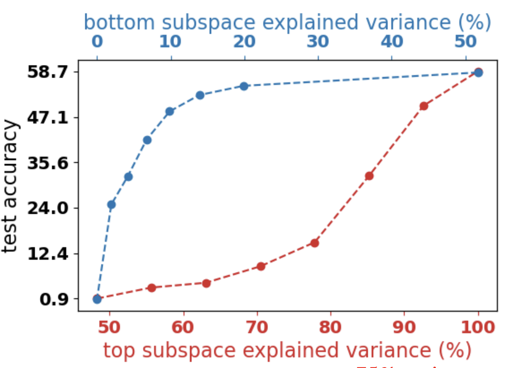
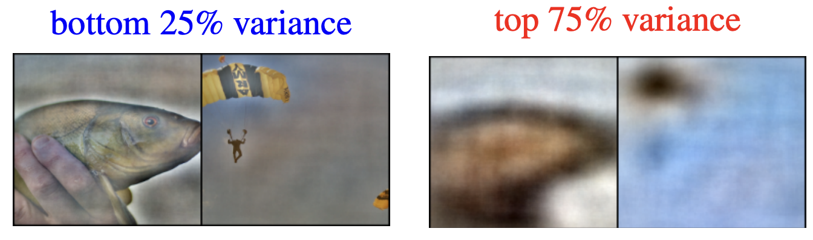
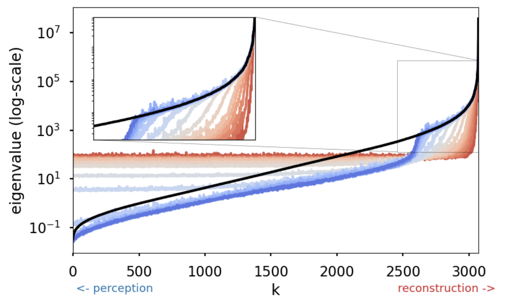
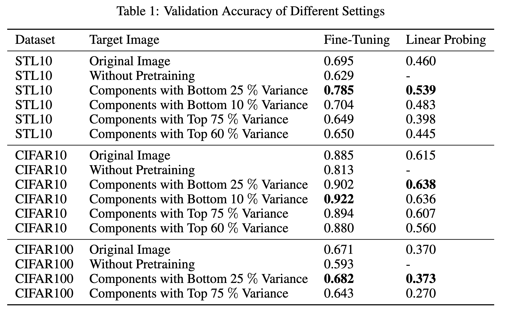
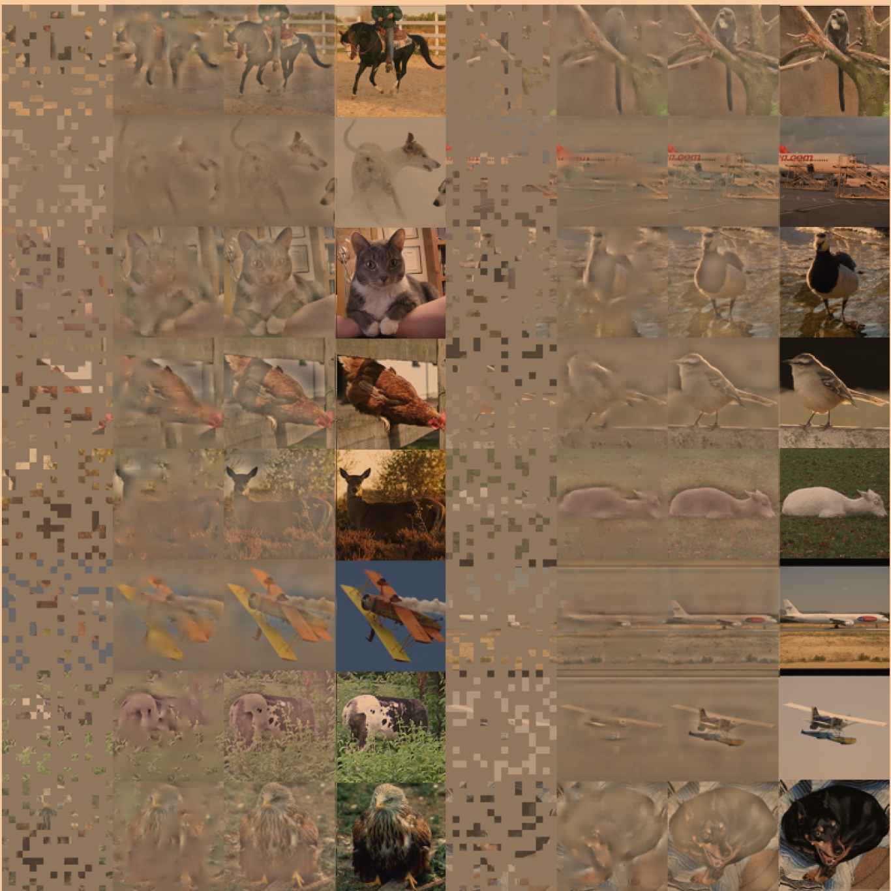
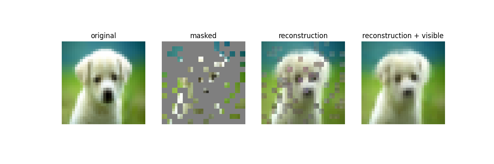

# Masked Autoencoders for Image Reconstruction

This repository carry out the implementation of a Masked Autoencoder for Image Reconstruction (MAE) using the several different datasets. The difference of this implementation from the original one is that this repository verifies the idea which is obtained from the paper "Learning by Reconstruction Produces Uninformative Features For Perception" by Randall Balestriero and Yann LeCun. The paper is available at [arXiv](https://arxiv.org/abs/2402.11337).

## About the Paper

### Feature Alignment and Misalignment:

* The paper presents that features learned by reconstructing the input data are not aligned with those required for downstream tasks (e.g. classification, detection, segmentation, etc.). Specifically, they show that the principal components of the data (those that explain the most variance and are learned first in reconstruction tasks) are the least useful for downstream tasks.
* For instance, in their experiments with TinyImagenet, projecting images onto the subspace that explains 90% of the pixel variance results in a test accuracy of only 45% in a supervised classification task. In contrast, using the bottom subspace that accounts for only 20% of the pixel variance yields a higher accuracy of 55%.

<figure align="center"> 
  
  <figcaption>Paper show that if we keep only the low-variance components of images, we can still train good classifiers on this data</figcaption>
</figure>

#### How to split the data into high-frequency and low-frequency components?

* Use PCA on the dataset of images to split the data into high-frequency and low-frequency components. PCA gives us the principal components of
the image dataset and sorts them in terms of explained variance.

* Then, we can filter out from images the components of our choice (e.g. top 90% of the variance, bottom 10% of the variance). 

<figure align="center"> 
  
  <figcaption>Example of image with components with high explained variance and components with low explained variance</figcaption>
</figure>

As you can see from the image above:
* Components with high explained variance tend to be very blurry, colorful images.
* Components with low explained variance tend to be more detailed, less colorful images.

### Order of Feature Learning:

* The paper demonstrates that reconstruction-based models, such as autoencoders, learn features in an order that prioritizes reconstructing the input data accurately rather than focusing on features that are informative for downstream tasks. This results in the most perceptually relevant features being learned last, which explains why these models often require long training times to perform well in tasks like classification.
* The authors visualize this process by showing how the training loss evolves over time, with features in the top eigenspace (those explaining the most variance) being learned first. Only after these are learned do features in the bottom eigenspace (which are more useful for downstream tasks) begin to be learned.

<figure align="center"> 
  
  <figcaption>Order of feature learning in reconstruction-based models</figcaption>
</figure>

### Implications for Model Design:
* MAE, which selectively removes parts of the input data, forces the model to focus on the remaining parts, potentially improving the learning of features that are useful for downstream tasks.
* The paper suggests that models like MAE, which encourage the learning of informative features, may be more effective for downstream tasks than other denoising autoencoders.

## About the Repository

As paper above suggests, the top principal components (those that explain the most variance) are the least useful for downstream tasks, while the bottom principal components (those that explain the least variance) are the most useful. We used the bottom principal components which are the most useful for downstream tasks to pretrain the MAE model.

* Input images are the original images.
* Target images are the images that high-variance components are filtered out from the original images.
* The model is trained to reconstruct the target images from the input images.

## Training the Model
### Installing Packages
```bash
conda create -n mae python=3.8
conda activate mae
pip install -r requirements.txt
```
### Remove Certain Percentage of top or bottom variance components from an image dataset and Plot the Images
```bash
python pca.py -c config/config_file.yaml
```

### Training the Model
```bash
python mae_pretrain.py -c config/config_file.yaml
```

### Pretrained models
You can download the weights of the pretrained masked autoencoder models from the following links:

<table>
  <tr>
    <th>Epochs</th>
    <th>Model</th>
    <th>Pretrained Dataset</th>
    <th colspan="5">Download</th>
  </tr>
  <tr>
    <td>400</td>
    <th>ViT-Tiny</th>
    <th>CIFAR10</th>
    <td><a href="https://huggingface.co/turhancan97/MAE-Models/blob/main/cifar10/no_mode/vit-t-mae-pretrain.pt">MAE Model with no PCA Mode</a></td>
  </tr>
  <tr>
    <td>400</td>
    <th>ViT-Tiny</th>
    <th>CIFAR10</th>
    <td><a href="https://huggingface.co/turhancan97/MAE-Models/blob/main/cifar10/bottom_25/vit-t-mae-pretrain.pt">MAE Model with bottom_25 PCA Mode</a></td>
  </tr>
  <tr>
    <td>2000</td>
    <th>ViT-Tiny</th>
    <th>STL10</th>
    <td><a href="https://huggingface.co/turhancan97/MAE-Models/blob/main/stl10/no_mode/vit-t-mae-pretrain.pt">MAE Model with no PCA Mode</a></td>
   </tr>
  <tr>
    <td>2000</td>
    <th>ViT-Tiny</th>
    <th>STL10</th>
    <td><a href="https://huggingface.co/turhancan97/MAE-Models/blob/main/stl10/bottom_25/vit-t-mae-pretrain.pt">MAE Model with bottom_25 PCA Mode</a></td>
   </tr>
</table>

## Evaluation of the Model
### Fine-Tuning and Linear Probing
```bash
cd eval/
python eval_finetune.py -c ../config/config_file.yaml
python eval_linprobe.py -c ../config/config_file.yaml
```
### Classification models
You can download the weights of the classification models from the following links:

<table>
  <tr>
    <th>PCA Mode</th>
    <th>Evaluation Type</th>
    <th>Pretrained Dataset</th>
    <th colspan="5">Download</th>
  </tr>
  <tr>
    <td>No Mode</td>
    <th>Fine-Tuning</th>
    <th>CIFAR10</th>
    <td><a href="https://huggingface.co/turhancan97/MAE-Models/blob/main/cifar10/no_mode/vit-t-mae-finetune.pt">MAE Encoder</a></td>
  </tr>
  <tr>
    <td>No Mode</td>
    <th>Linear Probing</th>
    <th>CIFAR10</th>
    <td><a href="https://huggingface.co/turhancan97/MAE-Models/blob/main/cifar10/no_mode/vit-t-mae-linprobe.pt">MAE Encoder</a></td>
  </tr>
  <tr>
    <td>bottom 25</td>
    <th>Fine-Tuning</th>
    <th>CIFAR10</th>
    <td><a href="https://huggingface.co/turhancan97/MAE-Models/blob/main/cifar10/bottom_25/vit-t-mae-finetune.pt">MAE Encoder</a></td>
   </tr>
  <tr>
    <td>bottom 25</td>
    <th>Linear Probing</th>
    <th>CIFAR10</th>
    <td><a href="https://huggingface.co/turhancan97/MAE-Models/blob/main/cifar10/bottom_25/vit-t-mae-linprobe.pt">MAE Encoder</a></td>
   </tr>
  <tr>
    <td>No Mode</td>
    <th>Fine-Tuning</th>
    <th>STL10</th>
    <td><a href="https://huggingface.co/turhancan97/MAE-Models/blob/main/stl10/no_mode/vit-t-mae-finetune.pt">MAE Encoder</a></td>
  </tr>
  <tr>
    <td>No Mode</td>
    <th>Linear Probing</th>
    <th>STL10</th>
    <td><a href="https://huggingface.co/turhancan97/MAE-Models/blob/main/stl10/no_mode/vit-t-mae-linprobe.pt">MAE Encoder</a></td>
  </tr>
  <tr>
    <td>bottom 25</td>
    <th>Fine-Tuning</th>
    <th>STL10</th>
    <td><a href="https://huggingface.co/turhancan97/MAE-Models/blob/main/stl10/bottom_25/vit-t-mae-finetune.pt">MAE Encoder</a></td>
   </tr>
  <tr>
    <td>bottom 25</td>
    <th>Linear Probing</th>
    <th>STL10</th>
    <td><a href="https://huggingface.co/turhancan97/MAE-Models/blob/main/stl10/bottom_25/vit-t-mae-linprobe.pt">MAE Encoder</a></td>
   </tr>
</table>

## About configuration file

Configuration file is used to set the hyperparameters of the model and the dataset. The configuration file is in the YAML format. 

For example, to remove the bottom 25% of the variance components from the custom dataset, PCA part the configuration file should be as follows:

```yaml
PCA:
  dataset: custom # imagenet, cifar10, cifar100, stl10 or custom
  split: val # train, val or test
  use_sklearn: False
  resize: 256
  crop: 224
  variance_cutoff: 0.25
```

On the other hand, the configurations for the MAE model is as follows:

```yaml
MAE:
  dataset: stl10 # imagenet, cifar10, cifar100, stl10 or custom
  pca_mode: no_mode # no_mode, bottom_20, bottom_25, bottom_30, bottom_35, bottom_40, top_70, top_75, top_80
  concentrate_high_variance_pixels: False
  batch_size: 4096
  max_device_batch_size: 512
  base_learning_rate: 1.5e-4
  weight_decay: 0.05
  mask_ratio: 0.75
  total_epoch: 2000
  warmup_epoch: 200
  model_name: vit-t-mae-pretrain.pt
  MODEL:
    image_size: 96 # 32 for cifar, 96 for stl10
    patch_size: 6 # 2 for cifar, 6 for stl10
    emb_dim: 192
    encoder_layer: 12
    encoder_head: 3
    decoder_layer: 4
    decoder_head: 3
```

You can change the hyperparameters of the model and the dataset by changing the configuration file.

## Results

<figure align="center"> 
  
  <figcaption>Quantitative results of our experiments</figcaption>
</figure>

<figure align="center"> 
  
  <figcaption>Example MAE Training Results: Reconstructing the Bottom 25% of PCA Components for a Set of Validation Images</figcaption>
</figure>

## Huggingface Model and Space

The link below provides access to the model and its corresponding space on Hugging Face. The models were trained on the CIFAR10 and STL10 datasets using the ViT-Tiny architecture.

* [MAE Models](https://huggingface.co/turhancan97/MAE-Models/tree/main)
* [MAE-Demo Space](https://huggingface.co/spaces/turhancan97/MAE-Demo)

## Demo

You can check the some of the demo scripts in the `demo` folder as jupyter notebooks.

<figure align="center"> 
  
  <figcaption>Example Single Image Inference</figcaption>
</figure>

## References

* [Learning by Reconstruction Produces Uninformative Features For Perception](https://arxiv.org/abs/2402.11337)
* [Masked Autoencoders Are Scalable Vision Learners](https://arxiv.org/abs/2111.06377)
* The training code is inspired by the [ViT-tiny PyTorch implementation of Masked Autoencoder](https://github.com/IcarusWizard/MAE)